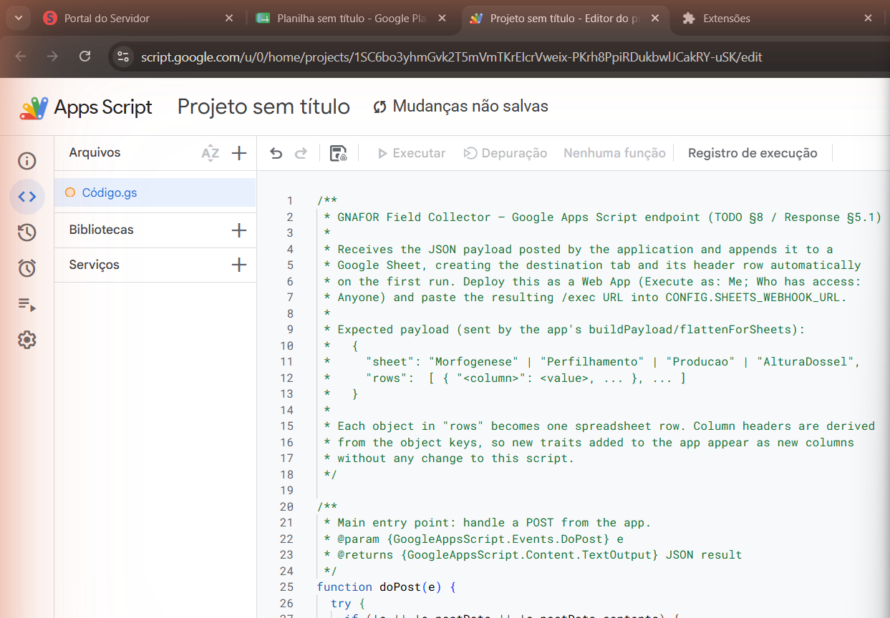
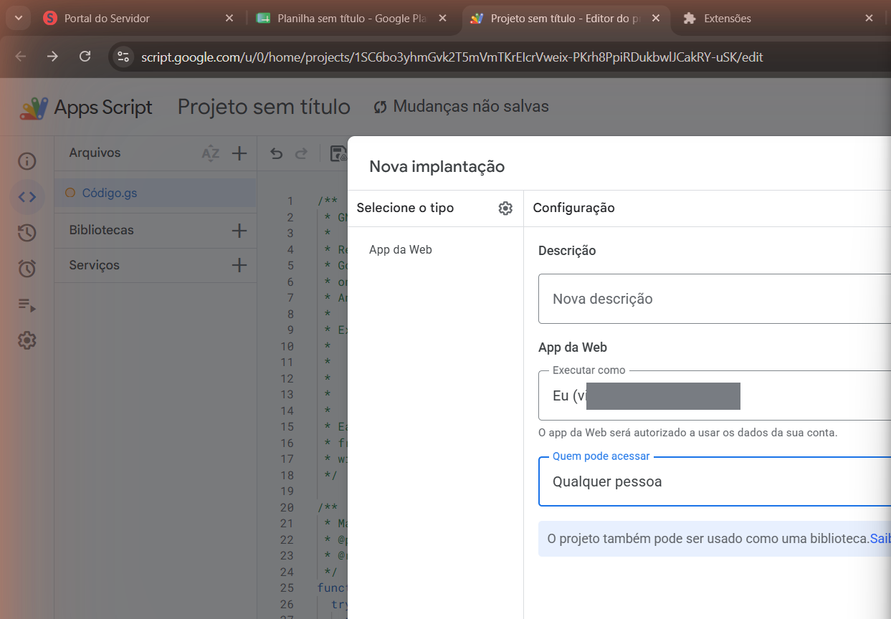

# GNAFOR Field Collector

[](https://github.com/viniciusvalimpereira/gnafor-field-collector/actions/workflows/ci.yml)
[](LICENSE)
[](https://doi.org/10.5281/zenodo.19266282)

**Mobile-first, single-file web application for systematic field data collection
in tropical forage grass experiments.**

🇧🇷 *Versão em português:* [README_pt.md](README_pt.md)

---

## Overview

GNAFOR Field Collector replaces paper-based field sheets in tropical forage
morphogenesis and productivity experiments. The entire application is a single
`.html` file (~200 KB) with **no runtime dependencies** — it runs in any modern
mobile browser, fully offline, and synchronizes to Google Sheets when a
connection is available. It was developed by the GNAFOR Research Group (Animal
Nutrition and Forage Science) at UEMG — Unidade Divinópolis, Brazil.

## Features

- **Four data collection modules:** leaf morphogenesis, tillering, dry mass
  production, and canopy height.
- **Client-side validation** with biologically meaningful ranges (hard limits
  block impossible values; soft limits prompt a confirm-to-save dialog).
- **Bilingual interface (PT/EN)** switchable at runtime; the choice is persisted.
- **Offline-first** localStorage queue with retry, plus a **capacity gauge**
  (warnings at 70% / 90% and automatic purge of transmitted records).
- **GPS tagging**, **CSV export** (UTF-8 BOM), and a **high-contrast** mode.
- **In-app Settings overlay** to configure the experiment without editing code.

## Quick start

1. Download `GNAFOR_FieldCollector_v1.1.html`.
2. Open it in any mobile browser (Chrome, Firefox, Safari, Edge).
3. Enter your name and start collecting. No installation, no server required.

## Configuration

Two ways to configure the experiment:

### A. Settings overlay (no code)

Tap the **⚙ Settings** button in the header to create/rename/delete treatments,
blocks and plots, set the number of pseudostems/leaves per evaluation, and
**export/import** the whole configuration as JSON to share with collaborators.
Changes are saved in `localStorage` and persist across sessions.

### B. CONFIG block (advanced)

For deployment defaults, edit the `CONFIG_DEFAULTS` block near the top of the
file:

```javascript
const CONFIG_DEFAULTS = {
  projetoNome: 'Your Project',
  nomeExp: 'Your Experiment',
  tratamentos: ['T1', 'T2', 'T3'],
  blocos: ['1', '2', '3', '4'],
  parcelas: ['1', '2', '3'],
  numPseudoc: 5,
  numFolhas: 7,
  SHEETS_WEBHOOK_URL: 'PASTE_YOUR_APPS_SCRIPT_EXEC_URL_HERE'
};
```

## Google Sheets setup (8 steps)

1. Open **Google Drive** and create a new **Google Sheets** file (e.g. `Dunamis_Field_Data`).
2. From the menu, choose **Extensions → Apps Script**.
3. Replace the contents of `Code.gs` with [`scripts/GoogleAppsScript_doPost.gs`](scripts/GoogleAppsScript_doPost.gs).
4. Click the disk icon to **save** and name the project (e.g. `GNAFOR Endpoint`).
5. Click **Deploy → New deployment → Web app**. Set **Execute as: Me** and **Who has access: Anyone**.
6. **Authorize** the script when prompted (Google login flow).
7. Copy the **`/exec` URL** shown in the deployment dialog.
8. Paste that URL into `CONFIG.SHEETS_WEBHOOK_URL` (or the Settings overlay).




The `doPost(e)` template creates each sheet tab and its header row automatically
on first run, and validates the payload before appending.

## Storage capacity

Data is held in `localStorage` until it is transmitted. Against a conservative
**4 MB** practical limit for mobile browsers, the device holds roughly:

| Module | Avg. serialized record | Records before the 70% warning |
|---|---|---|
| Leaf morphogenesis | ~420 B | ~9,500 |
| Canopy height | ~155 B | ~18,000 |
| Tillering | ~260 B | ~11,000 |

The header **storage gauge** shows the percentage in use, with a soft warning at
**70%** and a hard warning + forced sync at **90%**. Records already transmitted
to Google Sheets are purged automatically after a successful end-of-day sync.

## Internationalization (i18n)

All visible strings live in [`i18n/strings_pt.json`](i18n/strings_pt.json) and
[`i18n/strings_en.json`](i18n/strings_en.json) and are applied through a `t(key)`
helper. The PT/EN selector (login screen and navbar) switches every string at
runtime with no reload. `npm run i18n:check` enforces that both catalogues
expose exactly the same keys.

## Adding a new trait

Most adaptation (treatments, plots, counts) needs no code — use the Settings
overlay. To add a brand-new **measured variable** (worked example: *canopy
density*):

1. **Validation** — add an entry to `CONFIG.TRAITS` (documented near the top of
   the HTML; the schema is also in [`src/validation.js`](src/validation.js)):

   ```javascript
   CONFIG.TRAITS.canopy_density = { min: 0, max: 100, warn_min: 1, warn_max: 60, type: 'float', unit: 'kg/m3' };
   ```

2. **Form field** — add an `<input>` in the relevant module and include it in
   that module's `traitValidate()` mapping, e.g.
   `items.push({ traitKey: 'canopy_density', raw: data.canopyDensity, label: 'Canopy density' });`

The validation framework (hard/soft ranges, type and numeric guards) then
applies to the new trait automatically.

## Testing

```bash
npm install        # dev dependencies (Vitest, JSDOM)
python build.py    # regenerate the single-file app from src/ + i18n/
npm test           # run the test suite
npm run coverage   # tests + coverage report
```

The suite (Vitest + JSDOM) covers the validation rules, localStorage
serialization, the Google Sheets payload schema, CSV encoding (UTF-8 BOM and
Portuguese diacritics), the GPS fallback, and end-to-end boot/language/validation
of the built artifact. It runs automatically on every push via GitHub Actions.

## License

[MIT](LICENSE) © 2026 Vinícius Valim Pereira — UEMG, Unidade Divinópolis, Brazil.

## Citation

> Pereira, V. V. (2026). *GNAFOR Field Collector — Mobile-first web application
> for systematic field data collection in tropical forage grass experiments*.
> Zenodo. https://doi.org/10.5281/zenodo.19266282

See [`CITATION.cff`](CITATION.cff) for machine-readable metadata.
